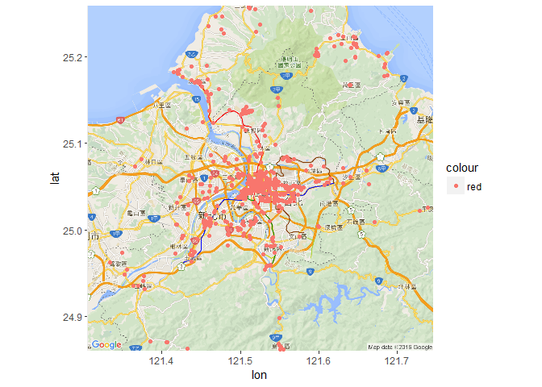

Final-Taipei
================

``` r
library("jsonlite")
Hotel_data <- fromJSON("http://data.taipei.gov.tw/opendata/apply/query/NDQxOEM2MDAtRDdGNS00NkQ2LUJCMUYtMURBMjlEQUI5MUU5?$format=json")
head(Hotel_data)
```

    ##   rownumber ref_wp cat1     cat2            serial_no   memo_tel
    ## 1       176      6 住宿 一般旅館                B0137 0227635889
    ## 2   1000206      0               C4_382000000A_002165           
    ## 3   1000207      0               C4_382000000A_002168           
    ## 4   1000208      0               C4_382000000A_002169           
    ## 5   1000209      0               C4_382000000A_002173           
    ## 6   1000210      0               C4_382000000A_002174           
    ##     memo_fax memo_cost memo_time             stitle
    ## 1 0227686656  6000以上                 幸福戀人旅館
    ## 2                                  松茂休閒農莊民宿
    ## 3                                      自然山居民宿
    ## 4                                阿里磅生態農場民宿
    ## 5                                      四個孩子民宿
    ## 6                                      可洛可呆民宿
    ##                                                                                                                                                                                                                                                                                                                                                                                                                                                                                                                                                                                                                                                                                                                                             xbody
    ## 1                                                                                                                                                                                                                                                                                                                                                                                                                                                                                                                                                                                                                                                                                                                                                
    ## 2  「松茂休閒農莊」位於淡水小坪頂，經過聖約翰技術學院（新埔工專），過了萊爾富便利商店後的派出所巷口右轉，再經一小段蜿蜒路，便可以看到好幾棟非常漂亮的別墅，「松茂休閒農莊」即在其中！　　如果已經和「松茂休閒農莊」預約投宿，開車者可以直接停進建地800多坪的「松茂休閒農莊」裡。熱情好客的老闆在此處培育了一些草藥和可食的植物，凡是到「松茂休閒農莊」的客人，都能享用自種、自製的桑椹汁，冰涼又爽口～　　「松茂休閒農莊」還有另外一大特點，這裡曾經是最佳的藥草浴地點，老闆年輕時因緣際會接觸了特殊藥草，在「好東西要和好朋友分享」的理念下，「松茂休閒農莊」有段時間也提供藥草浴服務。日子一久，慕名而來的客人越來越多，遂又在淡水區開了一家專做藥浴的店。但「松茂休閒農莊」的投宿者如對藥浴有興趣，老闆亦會提供藥包並詳細指導如何使用。　　坐 
    ## 3                位在萬里區磺潭村的「自然山居民宿」，建築物造型外型宛如私人的度假別墅，由於地處著名的磺潭社區裡，這座獲選為「2007年十大經典農漁村」的社區，周圍都有健康步道環繞，投宿者可以到社區裡的公園觀海亭欣賞日出、日落和觀星，遊客從早上和晚上都可欣賞到不同的優雅景色。　　　　磺潭社區活動中心保存的舊時農具，網羅犁、手扒、拿檔、石磨、簑衣等，是認識農村生活的知性所在，村莊茵綠草坪上的青銅水牛與小牧童也點出農村風，是遊客熱門的取景點之一。　　　磺潭社區發展協會的趴趴走一日套裝，是投宿「自然山居民宿」者所喜愛的活動，這項活動有生態導覽、紅龜粿DIY、焢窯、農村風味餐、泡湯、戲水等選擇組合，另外還有自然恬靜的景觀公園，絕對讓參加者享有超值、超完美的農村休閒旅遊。　營業時間：15:00入住，11:00退房　　優惠資訊：　刷卡：無　 
    ## 4                                                                                                                                                                                                 石門區的「濱海高爾夫球場」再繼續往前便是「阿里磅生態農場民宿」，既標榜是「生態農場」，當然以自然環境為主。「阿里磅生態農場」佔地將近11甲、標高130公尺左右，這個谷地獨立且優美，整個地形高低起伏，極具變化，與臺灣典型的早期鄉村景色非常相似。　　難得的是此處的地貌生態，保存的非常完整且還沒受到污染的破壞。該農場彷彿是隱身在石門山中的秘密花園，靜靜的等待旅人走訪，一同探索石門山林中，豐富多元的自然生態。　　　為讓下一代對大自然生態有更多體驗與認識，「阿里磅生態農場」特規劃住房加入合法民宿的陣容，設計活潑有趣的套裝活動，可先洽詢。
    ## 5 「四個孩子民宿」位於三芝芝柏藝術村裡，要在「四個孩子民宿」投宿，一定要透過網路或電話預定，且「四個孩子民宿」一路沒有指示牌，但主人會到約定地點接客人。　　唯一看得出「四個孩子民宿」的字眼，只是門口的招牌，黃老師很驕傲的說，這間民宿是她和三芝區人稱「麥勞」的先生，以及她的4個小孩，胼手胝足共同興建，打地基、砌牆壁、粉刷，除了鋼樑上架非請專業工人之外，「四個孩子民宿」都是一家人共同打造。　　何以三芝區的人都稱「四個孩子民宿」的經營者為黃「老師」，因為她本身即是安親班的負責人，雖然出生三芝著名企業家族，但是一點都沒生意人氣息，反而草根味十足。　　名稱非常特殊的「四個孩子民宿」，據黃老師解釋，這裡剛開始是經營托兒所，只有4個小孩，日子一久，托兒所遷移，改為民宿，遂以當初的「四個孩子」為這間民宿的名稱。「四個孩子民宿」為 
    ## 6        「可洛可呆民宿」位在三芝芝柏藝術村裡，為什麼會叫做「可洛可呆」？源於從事兒童藝術教育的負責人王老師，在住處前設計的信箱為「鱷魚張口狀」，王老師的先生遂以鱷魚的英文Crocodile，音譯為「可洛可呆」。為這間民宿命名為「可洛可呆」的先生，是集書法、繪畫與聲樂於一身的我國著名的藝術家楊子雲，是三芝芝柏藝術村的指標人物之一。　　「可洛可呆民宿」滲入楊子雲的藝術細胞，色調上呈現出十足浪漫的風格。而「可洛可呆民宿」透過楊子雲的形容，是以人文藝術為基礎的民宿，房子前面的粉紅色，顯現出女性之柔；房子後面則是整面三層樓的玻璃牆，有一片很棒的視野，小山坡中間可以看到一片海灘，和藍藍的海連著天。「可洛可呆民宿」的一樓，原本有一個房間，王老師特別將她改成有落地窗的美麗廚房，連結著前院的原木早餐桌，早上可以在蟲鳴鳥叫的氣氛下享用早餐 
    ##      avbegin      avend       idpt xurl                        address
    ## 1 2008-10-20 2015-09-09 臺北旅遊網      臺北市松山區八德路四段626號3樓
    ## 2 1900-01-01 1900-01-01                  新北市淡水區坪頂里坪頂路299號
    ## 3 1900-01-01 1900-01-01                      新北市萬里區員潭路16之9號
    ## 4 1900-01-01 1900-01-01                      新北市石門區阿里磅82之1號
    ## 5 1900-01-01 1900-01-01                   新北市三芝區茂長里芝柏路85號
    ## 6 1900-01-01 1900-01-01                    新北市三芝區茂長里聽濤街5號
    ##    xpostdate langinfo poi info   longitude   latitude
    ## 1 2015-09-09       10   Y      121.5741238 25.0498934
    ## 2 1900-01-01        0            121.47251   25.16237
    ## 3 1900-01-01        0            121.63401   25.19545
    ## 4 1900-01-01        0            121.59009   25.25236
    ## 5 1900-01-01        0            121.52528   25.23667
    ## 6 1900-01-01        0            121.51166   25.25607
    ##                                                                                                                                                                                                                                                                                                                                                               file
    ## 1 <file>http://www.travel.taipei/d_upload_ttn/frontsite/tw/hotel/B0137/B0137_1.JPG</img>http://www.travel.taipei/d_upload_ttn/frontsite/tw/hotel/B0137/B0137_2.JPG</img>http://www.travel.taipei/d_upload_ttn/frontsite/tw/hotel/B0137/B0137_3.JPG</img></file>
    ## 2                                                                                                                                                                                                                                                                                                                                                                 
    ## 3                                                                                                                                                                                                                                                                                                                                           http://mmweb.tw/36859/
    ## 4                                                                                                                                                                                                                                                                                                                                       http://www.albefarm.idv.tw
    ## 5                                                                                                                                                                                                                                                                                                                                           http://4kidshouse.com/
    ## 6                                                                                                                                                                                                                                                                                                                                 http://museumtravellers.okgo.tw/

``` r
library(reshape2)
Hotel_data.m <- melt(Hotel_data,id.vars = c('cat1','cat2','stitle','address'))
head(Hotel_data.m)
```

    ##   cat1     cat2             stitle                        address
    ## 1 住宿 一般旅館       幸福戀人旅館 臺北市松山區八德路四段626號3樓
    ## 2                 松茂休閒農莊民宿  新北市淡水區坪頂里坪頂路299號
    ## 3                     自然山居民宿      新北市萬里區員潭路16之9號
    ## 4               阿里磅生態農場民宿      新北市石門區阿里磅82之1號
    ## 5                     四個孩子民宿   新北市三芝區茂長里芝柏路85號
    ## 6                     可洛可呆民宿    新北市三芝區茂長里聽濤街5號
    ##    variable   value
    ## 1 rownumber     176
    ## 2 rownumber 1000206
    ## 3 rownumber 1000207
    ## 4 rownumber 1000208
    ## 5 rownumber 1000209
    ## 6 rownumber 1000210

``` r
library(ggmap)
```

    ## Loading required package: ggplot2

``` r
twmap.n <- get_map(c(121.43,24.93,121.62,25.19), zoom = 11,language = "zh-TW",maptype = 'roadmap')
```

    ## Warning: bounding box given to google - spatial extent only approximate.

    ## converting bounding box to center/zoom specification. (experimental)

    ## Map from URL : http://maps.googleapis.com/maps/api/staticmap?center=25.06,121.525&zoom=11&size=640x640&scale=2&maptype=roadmap&language=zh-TW&sensor=false

``` r
Hotel_data$longitude<-as.numeric(Hotel_data$longitude)
Hotel_data$latitude<-as.numeric(Hotel_data$latitude)

#ggmap(twmap.n) 

HotelMap = ggmap(twmap.n)+ geom_point(data=subset(Hotel_data), aes(x=Hotel_data$longitude, y=Hotel_data$latitude,color="red"))

HotelMap
```

    ## Warning: Removed 154 rows containing missing values (geom_point).


